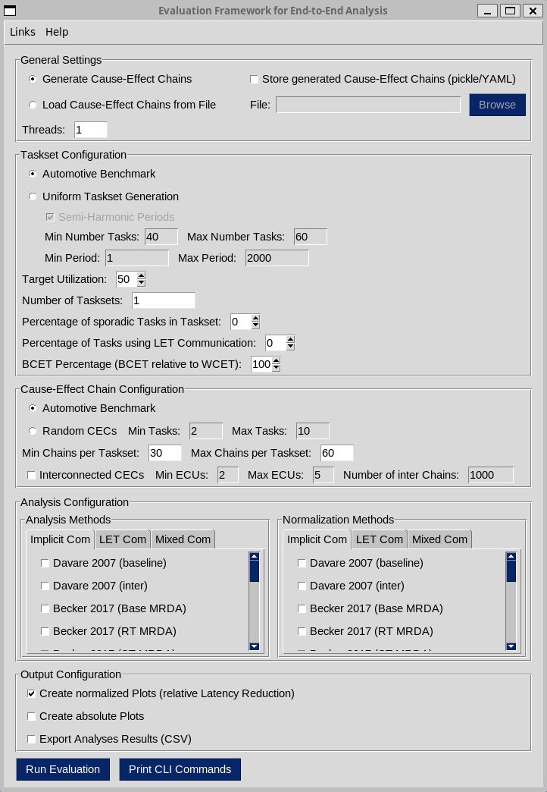

# E2EEvaluation
Evaluation framework for end-to-end analysis methods, published as part of my master's thesis (TODO:Link). It integrates many different end-to-end analysis methods and allows to evaluate them on different benchmarks. The framework can be used to perform the following steps:

1. Generating task sets

2. Generating cause-effect chains for the generated task sets

3. Analyzing cause-effect chains using various end-to-end analysis methods

4. Evaluating the results of the analyses

## Setup
To use the evaluation framework, python3 is necessary. python3.10 was used during the development, but newer versions will likely work as well.
Additionally, the following commands can be executed to install the necessary software to run the framework (replace python3.X with the python version you are using):

- ```sudo apt install software-properties-common cmake git python3.X-venv python3.X-dev python3.X-tk```

Then clone this repository and enter it:

- ```git clone https://github.com/tu-dortmund-ls12-rt/E2EEvaluation.git```
- ```cd E2EEvaluation```

Create a virtual environment to safely install python packages without dependency issues and activate it:

- ```python3.X -m venv e2eEval```
- ```. e2eEval/bin/activate```

Install the python packages necessary to launch the evaluation framework. All of the necessary packages are specified in the requirements.txt, which can be automatically loaded and installed using the following command:

- ```pip install -r requirements.txt```

Otherwise the required python packages can also be installed manually using the following commands:

- ```pip install scipy numpy matplotlib PyYAML```
- ```pip install pySimpleGUI/PySimpleGUI-4.60.5.tar.gz```
- ```pip install git+https://github.com/JasonGross/tikzplotlib.git```

The virtual environment can be deactivated using the following command:

- ```deactivate```

## Running the Framework

The Framework offers a graphical user interface as well as a command line interface that can be used to configure an evaluation.

### Graphical User Interface

To start the graphical user interface, the following commands can be used from the root directory of the evaluation framework:

- ```. e2eEval/bin/activate```
- ```python3.X e2eMain.py```



### Command Line Interface

The evaluation framework can also be used via the command line. Therefore, multiple arguments can be passed when launching the framework.

1. Generating cause-effect chains via the CLI:

    ```python3.X e2eMain.py generate-cecs [options]```

    This command is used to generate a file containing cause-effect chains. The output generated is similar to the output generated by the GUI mode, one pickle and one yaml file containg the chains in the same folder structure. (TODO: options?)

    Example Command:
    ```
    python3.X e2eMain.py generate-cecs -t 10 --use_uniform_taskset_generation --use_semi_harmonic_periods --target_util=0.7 --number_of_tasksets=1000 --generate_automotive_cecs
    ```

2. Analyzing cause-effect chains via the CLI (simple):

    ```python3.X e2eMain.py <analysis> <cec_file> [threads]```

    This command can be used to analyze a file containing cause-effect chains with a single analysis method from the framework. Optionally, the number of threads can be set with ```[threads]``` (default 1). When the analysis is completed, all of the computed latencies are printed to console.

    Example Command:
    ```
    python3.X e2eMain.py guenzel23_l_mrt cause_effect_chains.pickle 4
    ```

3. Analyzing cause-effect chains via the CLI (advanced):

    ```python3.X e2eMain.py analyze-cecs [options]```

    This command is used to analyze a file containing cause-effect chains with one or multiple analysis methods. The output generated is similar to the output generated by the GUI mode (absolute plots, normalized plots and csv in the same folder structure). (TODO: options?)

    Example Command:
    ```
    python3.X e2eMain.py analyze-cecs -t 10 -a kloda18 -a duerr19_mrt -a guenzel23_l_mrt -n davare07 -f output/2024-08-04_Test001/cause_effect_chains.pickle --normalized_plots --absolute_plots --raw_analysis_results
    ```

## Analyses Overview

List of papers with analysis methods relevant for the framework:

| Paper                                                                                             | Repository                                                                    | Periodic | Sporadic | Implicit | LET   | Result       | Status     |
|---------------------------------------------------------------------------------------------------|-------------------------------------------------------------------------------|----------|----------|----------|-------|--------------|------------|
| [Davare 2007](https://ieeexplore.ieee.org/document/4261191)                                       |                                                                               | Yes      | (Yes)    | Yes      | No    | MRT          | Integrated |
| [Becker 2016](https://ieeexplore.ieee.org/document/7579951)                                       |                                                                               | Yes      | No       | Yes      | No    | MRDA         | Integrated (w/o restricted data propagation) |
| [Becker 2017](https://www.sciencedirect.com/science/article/pii/S1383762117300681)                |                                                                               | Yes      | No       | Yes      | Yes   | MRDA         | Integrated |
| [Hamann 2017](https://drops.dagstuhl.de/entities/document/10.4230/LIPIcs.ECRTS.2017.10)           |                                                                               | Yes      | Yes      | No       | Yes   | MDA/MRT      | Integrated |
| [Kloda 2018](https://ieeexplore.ieee.org/document/8502498)                                        |                                                                               | Yes      | No       | Yes      | No    | MDA/MRT      | Integrated |
| [Dürr 2019](https://dl.acm.org/doi/10.1145/3358181)                                               |                                                                               | Yes      | Yes      | Yes      | (Yes) | MRDA,MDA/MRT | Integrated |
| [Kordon 2020](https://hal.science/hal-03041732)                                                   |                                                                               | Yes      | No       | No       | Yes   | MDA          | Requested  |
| [Martinez 2020](https://link.springer.com/article/10.1007/s11241-020-09350-3)                     |                                                                               | Yes      | No       | Yes      | Yes   | MDA/MRT      | Missing    |
| [Bi 2022](https://dl.acm.org/doi/abs/10.1145/3489517.3530609)                                     |                                                                               | Yes      | No       | Yes      | No    | MRDA         | Integrated |
| [Gohari 2022](https://dl.acm.org/doi/abs/10.1145/3534879.3534893)                                 | [np-data-age-analysis](https://github.com/porya-gohary/np-data-age-analysis)  | Yes      | No       | Yes      | No    | MRDA         | Integrated (via system call) |
| [Günzel 2021](https://ieeexplore.ieee.org/document/9470490)                                       | [end-to-end](https://github.com/tu-dortmund-ls12-rt/end-to-end)               | Yes      | (Yes)    | Yes      | Yes   | MRDA,MDA/MRT | Integrated |
| [Günzel 2023 (mixed)](https://dl.acm.org/doi/10.1145/3575757.3593640)                             | [end-to-end_mixed](https://github.com/tu-dortmund-ls12-rt/end-to-end_mixed)   | Yes      | Yes      | Yes      | Yes   | MRT          | Integrated |
| [Günzel 2023 (inter)](https://dl.acm.org/doi/10.1145/3587036)                                     | [end-to-end_inter](https://github.com/tu-dortmund-ls12-rt/end-to-end_inter)   | Yes      | (Yes)    | Yes      | Yes   | MRDA,MDA/MRT | Integrated |
| [Günzel 2023 (equi)](https://drops.dagstuhl.de/entities/document/10.4230/LIPIcs.ECRTS.2023.10)    | [mrt_mda](https://github.com/tu-dortmund-ls12-rt/mrt_mda)                     | Yes      | (Yes)    | (Yes)    | Yes   | MDA/MRT      | Integrated |
|                                                                                                   |                                                                               |          |          |          |       |              |            |
| [Pazzaglia 2022](https://ieeexplore.ieee.org/document/9858081)                                    | [ChainMiss](https://github.com/PaoloPazzaglia/ChainMiss)                      | Yes      | No       | No       | Yes   | ?            | Received   |
|                                                                                                   |                                                                               |          |          |          |       |              |            |
| [Teper 2022](https://ieeexplore.ieee.org/document/9984789)                                        | [ros2-end-to-end](https://github.com/HarunTeper/ros2-end-to-end)              | ?        | ?        | ?        | ?     | ?            | Received   |
| [Kloda 2022](https://ieeexplore.ieee.org/document/9774655)                                        |                                                                               | Yes      | No       | Yes      | No    | MRT          | Missing    |
| [Tang 2023](https://ieeexplore.ieee.org/document/10248012)                                        |                                                                               | Yes      | No       | Yes      | No    | ?            | Missing    |


## File structure

    .
    ├── benchmarks                      # Folder with all available benchmarks
    │	├── benchmark_Uniform.py        # Uniform taskset/cec generation
    │	└── benchmark_WATERS.py         # Automotive (WATERS) benchmark
    ├── cechains				
    │	├── chain.py                    # Definiton of a cause-effect chain
    │	└── jobchain.py                 # Definiton of a job-chain
    ├── doc                             # Images for documentation
    ├── e2eAnalyses                     # All analysis methods of the framework
    │	├── Becker2017.py
    │	├── BeckerFast.py
    │	├── Bi2022.py
    │	├── Davare2007.py
    │	├── Duerr2019.py
    │	├── Gohari2022.py
    │	├── Guenzel2023_equi.py
    │	├── Guenzel2023_equi_extension1.py
    │	├── Guenzel2023_equi_extension2.py
    │	├── Guenzel2023_inter.py
    │	├── Guenzel2023_mixed.py
    │	├── Hamann2017.py
    │	├── Kloda2018.py
    │	├── Kordon2020.py
    │	└── Martinez2020.py
    ├── external                        # Directory for loosely integrated analyses
    ├── output                          # Output directory with evaluation results
    ├── plotting
    │	└── plot.py                     # Methods for creating the box plots
    ├── pySimpleGUI
    │	└── PySimpleGUI-4.60.5.tar.gz   # Last free software version of PSG
    ├── tasks
    │	├── job.py                      # Definition of a job
    │	├── task.py                     # Definition of a task
    │	└── taskset.py                  # Definition of a taskset
    ├── utilities                       # Extra code, only necessary for some analyses
    │	├── analyzer_guenzel23.py       # Utility file for Guenzel2023_inter
    │	├── augmented_job_chain.py      # Utility file for Guenzel2023_inter
    │	├── csv_import_gohari.py        # Imports the result generated by gohari22
    │	├── event_simulator.py          # Used by the scheduler
    │	├── scheduler.py                # Common scheduler
    │	├── yaml_export_gohari.py       # Export with special format for gohari22
    │	└── yaml_export.py              # Export of cause-effect chains and task sets
    ├── .gitignore
    ├── consoleInterface.py             # Parses the given console arguments
    ├── e2eMain.py                      # Main file to start the framework
    ├── framework.py                    # Logic of the framework
    ├── graphicalInterface.py           # Starts the GUI and collects input values
    ├── helpers.py                      # Helpers for file access
    ├── LICENSE
    ├── README.md
    └── requirements.txt

## Other Repositories

For creating this framework [PySimpleGUI](https://www.pysimplegui.com/) was used. Since the authors of PySimpleGUI decided to introduce a proprietary license for newer versions of their gui framework, it is currently not possible to use it without a license. However, any version that was published before introducing the proprietary license can still be used as free software, therefore PySimpleGUI 4.60.5 is included in this project. Also, there exist some interesting forks that will maybe replace PySimpleGUI in the future (see: [FreeSimpleGUI](https://github.com/spyoungtech/FreeSimpleGUI)).

For creating the tikz-output, the code from [JasonGross/tikzplotlib](https://github.com/JasonGross/tikzplotlib) is used. This code was forked from [nschloe/tikzplotlib](https://github.com/nschloe/tikzplotlib) and is currently much better maintained than the repository from the original author.
